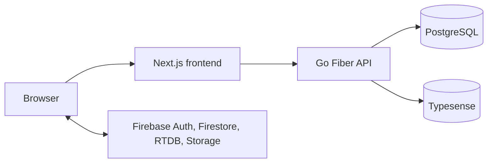

# Convoza

## Project overview

Convoza is a real-time chat application for direct and group conversations. It supports media, replies, typing indicators, presence, delivery and read state, and full-text search.

The frontend uses Next.js 16 and React 19. The API is Go Fiber. PostgreSQL stores user and authentication records, Firebase provides Authentication, Firestore, Realtime Database, and Storage. Typesense provides search.

## Architecture



There are two boundaries:

- The frontend reads and listens to Firebase directly for real-time data.
- Any mutations go through the Go API.

## Requirements and Firebase configuration

Install Docker Compose, Go 1.26.1, Node.js 20 or newer, and npm.

This project uses Firebase. Configure a Firebase project manually in Firebase Console, then create or enable:

- A web app
- Email/Password and Google authentication providers
- Firestore in Native mode
- Realtime Database
- Cloud Storage
- A service-account key

Place the same service-account JSON at both `backend/firebase-service-account.json` and `frontend/firebase-service-account.json`. These files are ignored by Git. Do not put credentials or tokens in environment examples.

## Quick start

1. Create local environment files and fill in the Firebase values from your web app and project:

   ```bash
   cp backend/.env.example backend/.env
   cp frontend/.env.example frontend/.env.local
   ```

2. Copy your service-account JSON to both service directories:

   ```bash
   cp /path/to/service-account.json backend/firebase-service-account.json
   cp /path/to/service-account.json frontend/firebase-service-account.json
   ```

3. Start the complete local stack:

   ```bash
   docker compose -f compose.dev.yml up --build
   ```

Local services:

| Service | URL |
| --- | --- |
| Frontend | http://localhost:3001 |
| API | http://localhost:5000 |
| Typesense | http://localhost:8108 |
| Typesense Dashboard | http://localhost:8080 |

Smoke check: register two users in separate browser sessions, start a chat, send a message, and confirm that the second session receives it without a reload.

## Local search

Typesense starts with the Compose stack. The backend creates its collections when `TYPESENSE_API_KEY` is set. The frontend uses its no-results search client when `NEXT_PUBLIC_SEARCH_ENGINE` is unset.

Configure the local Typesense service with these values in the local environment files:

| File | Variables |
| --- | --- |
| `backend/.env` | `TYPESENSE_URL=http://localhost:8108`, `TYPESENSE_API_KEY=xyz` |
| `frontend/.env.local` | `NEXT_PUBLIC_SEARCH_ENGINE=typesense`, `NEXT_PUBLIC_TYPESENSE_HOST=localhost`, `NEXT_PUBLIC_TYPESENSE_PORT=8108`, `NEXT_PUBLIC_TYPESENSE_SEARCH_ONLY_API_KEY=xyz` |

The Compose service uses `xyz` as its local default API key unless `TYPESENSE_API_KEY` is supplied to Compose.

## Daily development and repository map

For focused native work:

```bash
cd backend
go run .
air # Runs the backend server with hot reload.
go build -o build/apiserver .
go test ./app/services/...
go test ./pkg/routes/...

cd ../frontend
npm run dev
npx tsc --noEmit
npm run lint
```

Optional local fixtures:

```bash
cd backend
go run ./cmd/dev-seed
go run ./cmd/dev-seed-gap
```

- `backend/` contains the Go API, application layers, platform integrations, and migrations.
- `frontend/` contains the Next.js application, Firebase client code, and chat interface.
- `compose.dev.yml` starts the complete local development stack. `compose.db.yml` remains the lightweight database-only option.
- `backend/cmd/` contains standalone development and maintenance programs.
- `scripts/` contains Firebase administration, local fixture, search-index, and migration utilities. Its Node-based tools use the dependencies in `scripts/package.json`.

For service-specific guidance, see the [backend README](backend/README.md) and [frontend README](frontend/README.md).

## Documentation

Implementation handoffs are collected in [docs/handoff](docs/handoff/), and project presentation decks are in [docs/presentation](docs/presentation/). These handoff documents are works in progress, so not every feature or implementation has a handoff file yet.

## Troubleshooting

- **Service account missing:** add the JSON file at both required paths and confirm each local environment file points to `./firebase-service-account.json`.
- **Firebase values differ:** frontend web-app values and backend Firebase project settings must refer to the same Firebase project.
- **Authentication sync fails after startup:** run the PostgreSQL migration command in Quick start.
- **Browser reports a CORS error:** use `http://localhost:3001` for the frontend and keep `ALLOWED_ORIGINS` set to that address in `backend/.env`.
- **Typesense is unavailable:** confirm that port 8108 is free and the Typesense container is running.
